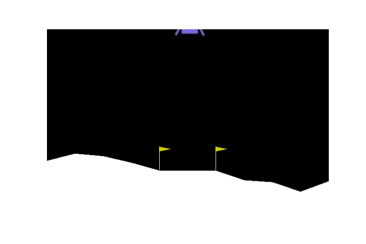
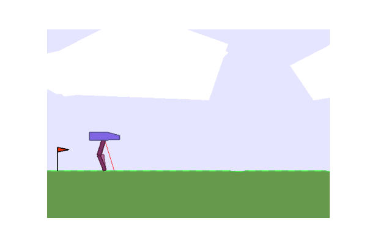
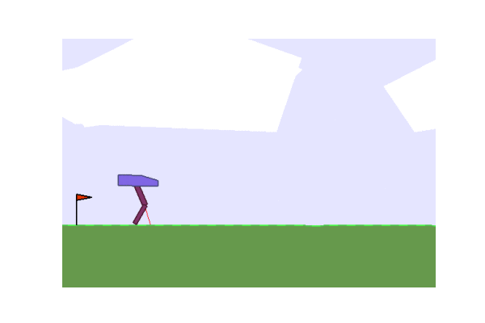

# Gradient Evolution

We rediscovered the idea of gradient based evolution presented in **Nature-Inspired Algorithms for Optimisation by Thomas Weise, Michael Zapf, Raymond Chiong, Antonio J. Nebro, Raymond Chiong** in the chapter **The Evolutionary-Gradient-Search Procedure in Theory and Practice**. The basic motivation is to improve each step of the evolution by approximating the gradients using some function (black box) calls. We also show that this idea works better for many experiments we have done.

For the theory and basic algorithm, please refer to [algorithm.pdf](algorithm.pdf)
A very rough proof is available in the [proof.xopp](proof.xopp) file. We are planning to upload a more formal proof in the future.

### Results on some OpenAI problems

#### Lunar Lander

lander results after 80 iterations

| Gradient evolution: | Normal ES: |
| :---: | :---: |
|  |  |

#### Bipedal Walker

walker results after 80 iterations

| Gradient evolution: | Normal ES: |
| :---: | :---: |
|  |  |
                                                 

Benchmarking results on Restrigin function and Image Reconstruction are available in [algorithm.pdf](algorithm.pdf).

### To-Do
- Add formal [proof](proof.xopp)
- [Implement](julia/image_reconstruction.jl) in the Julia Programming Language

### Authors
- [Tanmay Kumar Sinha](https://github.com/Tanmay-Kumar-Sinha)
- [Chaitanya Kharyal](https://github.com/Kharyal)
